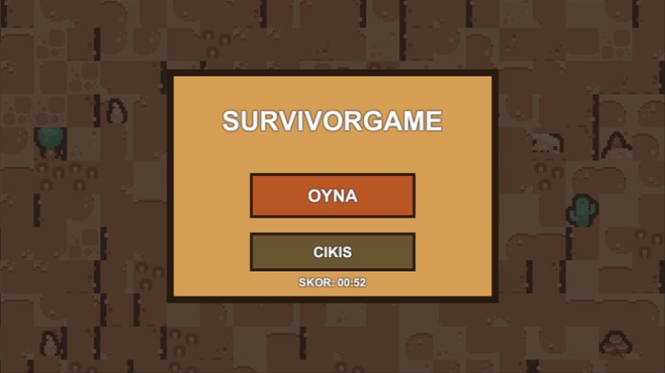
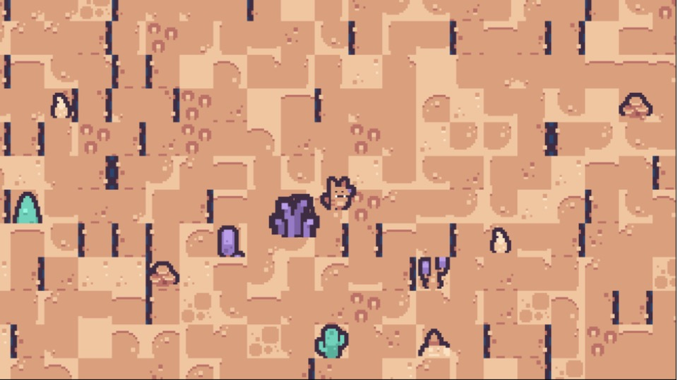
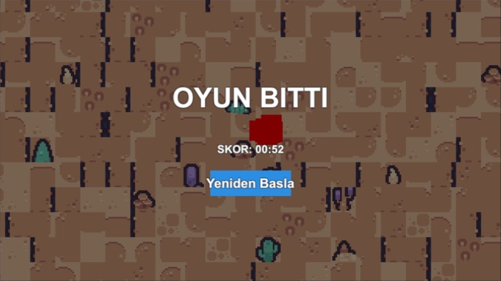

# SurvivorGame

A 2D horde-survival shooter built in Unity, inspired by *Vampire Survivors*. You play a lone survivor in a desert wasteland, auto-throwing knives at an endlessly growing swarm of enemies while leveling up and choosing upgrades to stay alive as long as possible.

Built solo — design, programming, pixel-art integration, UI, and sound design — as a portfolio project.

## Features

- **Auto-combat core loop**: the player automatically throws knives at the nearest enemy; survival depends entirely on movement, positioning, and the upgrades you pick.
- **Leveling & upgrades**: collect XP orbs dropped by defeated enemies, level up, and choose from randomized upgrades (move speed, max health, attack damage, attack speed, attack range).
- **Escalating difficulty**: enemy spawn rate ramps up continuously over the first few minutes, and tougher enemy types (Scout, Brute) unlock as the player levels up — the run gets harder in two independent ways, not just "more of the same."
- **Enemy variety**: three regular enemy types with distinct stats, scale, and movement feel, plus a recurring Boss enemy (bigger, tankier, visually distinct) that arrives on its own timer.
- **Pixel-art desert theme**: custom-styled UI (main menu, pause menu, game over, upgrade screen) built to match the pixel-art sprite set, plus a hand-composited app icon.
- **Juice**: hit particles, camera shake, and animated sprites (walk cycles, tilt/hop motion) for readable, satisfying feedback.
- **Full audio**: every sound effect and the background music track are procedurally synthesized (8-bit/chiptune style) rather than sourced from a library — zero external audio dependencies or licensing concerns.
- **Pause menu & settings**: ESC toggles pause, with independent SFX/music volume sliders that persist across sessions.
- **High score tracking**: best survival time is saved locally and shown on the main menu and game-over screen.
- **Localization**: UI text is localized (Turkish / English), switching automatically based on system language.

## Tech stack

- **Engine**: Unity 6 (6000.3.24f1), Universal Render Pipeline (2D Renderer)
- **Language**: C#
- **UI**: Unity UGUI (legacy Text/Image/Button), built and iterated on via a custom in-editor tool rather than hand-placed in the Scene view
- **Physics**: `Rigidbody2D`-driven movement for player and enemies
- **Performance**: object pooling for enemies, projectiles, and XP orbs to avoid runtime `Instantiate`/`Destroy` churn during heavy combat
- **Art**: [Kenney](https://kenney.nl) CC0 pixel-art sprite packs (post-processed to remove a baked-in white outline artifact)
- **Audio**: procedurally generated in Python (NumPy) — square/triangle waveforms, envelopes, and frequency sweeps, exported as WAV

## Screenshots

| Main menu | Gameplay | Game over |
|---|---|---|
|  |  |  |

## How to play

- **Move**: WASD / arrow keys
- **Attack**: automatic — the nearest enemy in range is targeted
- **Pause**: Esc
- Survive as long as possible, level up, and pick upgrades to out-scale the swarm.

## Running the project

1. Open the project folder in **Unity Hub** (Unity **6000.3.24f1** or later recommended).
2. Open the `Assets/player.unity` scene.
3. Press **Play** in the Editor, or use **File > Build Profiles > Build** to produce a standalone build.

## Project structure highlights

```
Assets/
  Scripts/        Gameplay, UI, audio, and camera scripts
  Editor/         Custom in-editor tool used to build/rebuild UI, prefabs, and systems
  Prefabs/        Player, enemy, projectile, and XP orb prefabs
  Sprites/        Kenney pixel-art sprite sheets
  Audio/          Procedurally generated SFX and music (WAV)
  Icon/           App icon
```

## Credits

- Pixel-art sprites: [Kenney](https://kenney.nl) (CC0 / public domain)
- Everything else (code, audio, UI design, integration): Berra Aktel

## License

Code in this repository is available under the [MIT License](LICENSE). Third-party art assets remain under their original CC0 license from Kenney.
